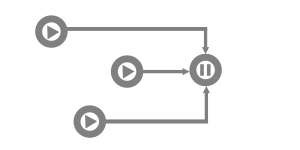

# awaiter
> WaitGroup like module to await goroutines

By [v-braun - viktor-braun.de](https://viktor-braun.de).

[](https://github.com/v-braun/awaiter/blob/master/LICENSE)
[](https://travis-ci.org/v-braun/awaiter)
[](https://codecov.io/gh/v-braun/awaiter)


<p align="center">

</p>


## Description

Awaiter is similar to a WaitGroup but simplifies the resource handling.  

*change this:*

``` go
wg := new(sync.WaitGroup)

counter := 0

wg.Add(1)
go func() {
    defer wg.Done()
    time.Sleep(time.Second * 1)
    counter += 1
}()

wg.Add(1)
go func() {
    defer wg.Done()
    time.Sleep(time.Second * 1)
    counter += 1
}()

wg.Wait()

fmt.Printf("counter: %d", counter)
// Output: counter: 2
``` 


*to this:*

``` go
awaiter := awaiter.New()

counter := 0

awaiter.Go(func() {
    time.Sleep(time.Second * 1)
    counter += 1
})

awaiter.Go(func() {
    time.Sleep(time.Second * 1)
    counter += 1
})

awaiter.AwaitSync()

fmt.Printf("counter: %d", counter)
// Output: counter: 2
``` 

## Installation
```sh
go get github.com/v-braun/awaiter
```


## Authors

  
[v-braun](https://github.com/v-braun/)


## Contributing

Make sure to read these guides before getting started:
- [Contribution Guidelines](https://github.com/v-braun/awaiter/blob/master/CONTRIBUTING.md)
- [Code of Conduct](https://github.com/v-braun/awaiter/blob/master/CODE_OF_CONDUCT.md)

## License
**awaiter** is available under the MIT License. See [LICENSE](https://github.com/v-braun/awaiter/blob/master/LICENSE) for details.
